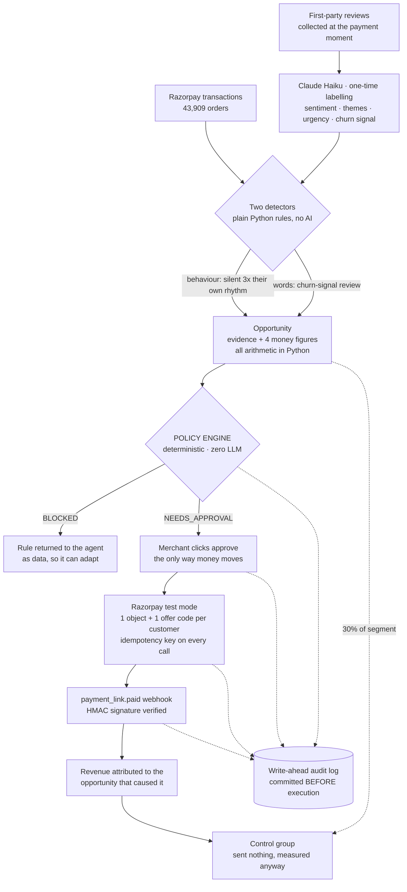

# RevPulse — Architecture

## The proactive layer — `backend/app/opportunities.py`

This is what makes the thing an agent rather than a dashboard with a chat box. Nothing here waits to be asked.

**Two detectors, and the split is deliberate.** Reviews exist for a small minority of customers; transaction behaviour exists for all of them. Behaviour is therefore the *primary* churn signal and reviews are the *enrichment* layer.

`detect_lapsed_high_value()` uses transactions alone — no reviews, no model. A customer qualifies when they have real history (lifetime spend and order count above the line), an established rhythm, and have now been silent for more than three times their **own** median gap between orders. Measuring against their own past behaviour rather than a global cut-off is the point: a weekly customer going quiet for a month means something a quarterly customer going quiet for a month does not. Its threshold sits deliberately lower than the churn detector's, because a lapsed customer has already stopped — the loss is realised, not hypothetical — whereas a churn-signal customer is still active and merely says they may leave.

`detect_churn_risk()` uses the review signal to catch the other group: customers who have *not* yet gone quiet but whose own words say they are about to. It also supplies the reason, which shapes what the merchant says to them and tells them what to fix.

**Detection is deterministic.** A churn-risk signal is a rule, not a vibe: a churn-flagged review inside the lookback window from a customer whose lifetime spend clears the high-value line (₹15,000 — the same threshold the evaluation harness scores against, so detection is measurable rather than assertable). Customers the guardrails would refuse — recently offered, already redeemed — are filtered out *before* the proposal is formed, and the count of who was excluded is shown to the merchant. The bounds shape the proposal; they are not a veto bolted on afterwards.

**The money maths never touches the model.** Four figures are computed, and they are deliberately not collapsed into one headline. *Lifetime value at risk* is summed from real orders — it says how much the relationship has been worth, and is explicitly not what the offer recovers, because money already spent is already banked. *Realistically recoverable* is what one returning order from each customer is worth at the discounted price: the honest upper bound of this intervention. *Expected recovered* is that figure times an assumed redemption rate, labelled as a projection with the assumption printed beside it. *Maximum exposure* is exact: the incentive given away if every targeted customer redeems. The model receives these figures and writes two or three sentences of explanation; it is told to use only the numbers given. If that call fails, a deterministic sentence takes its place and the opportunity is still fully usable — the language is a convenience, the substance is not.

**The guardrails run before the merchant ever sees the card.** Each opportunity carries the verdict its action would receive, so the UI can say "needs your approval" honestly instead of promising something the policy engine would refuse. `policy.check_proactive()` adds one rule on top of the normal bounds: an action the agent raises on its own initiative always escalates to a human, even when every other bound is clear. An agent spending money because it decided to is a different risk class from one executing what the merchant just asked for.

The verdict shown at scan time is a preview, never an authorisation. When the merchant approves, the action is re-checked against the policy engine at that moment — budget may have been spent, an offer may have gone out elsewhere — and only then executed.

**The loop closes.** Execution creates one Razorpay object and one unique offer code per customer; the payment webhook attributes the payment back through the campaign to the opportunity that caused it. `outcome` on an opportunity is therefore a join, not an estimate: targeted, redeemed, revenue attributed, incentive actually paid.

**Attribution is not causation, so there is a control group.** Proving a payment arrived through our link says nothing about whether that customer would have come back anyway — the money may simply have been discounted for no reason. When a segment is large enough (six customers), roughly 30% are held back: same profile, no offer, no link. Return rates are then compared across both groups over the same window, counting *any* order rather than only ones through our links, since a control customer has none and a treated customer who returns by another route still returned. The split is seeded off the campaign id, so it is reproducible and cannot be quietly re-rolled until the numbers look better. Below six customers the holdout is skipped and the reason is recorded — a control group of two proves nothing, and saying so is more useful than producing a figure that resembles evidence.

Proven end to end, repeatably, by `scripts/test_agent_loop.py`: detect → evidence → bounded maths → gate → approval → real Razorpay object → webhook → attribution → audit trail.

## Demand planning — `backend/app/demand.py`

A second, deliberately different capability. The win-back agent recovers customers by spending money; this one protects revenue by preparing operations, and it creates no offer, no payment link and no Razorpay object at all. Not every agent action should become a transaction.

The forecast is the median of the most recent comparable windows in the merchant's own history — interpretable on purpose, so the evidence shown to the merchant ("13 of the last 14 Fridays ran busier") is the actual basis of the number rather than a story told about a model. Confidence comes from how many comparable occurrences exist and how consistently they ran above a normal day.

Accuracy is measured by walk-forward backtest: each of the last few windows is re-forecast using only the data available before it, then compared with what happened. That gives an honest accuracy figure without waiting for the future to arrive.

The model is called exactly once, on finished numbers, to turn them into a sentence an owner would say out loud — and the result is cached per forecast. It never produces a figure.

## Components

### Agent loop — `backend/app/agent/loop.py`

The whole brain is ~40 lines, on the raw Anthropic SDK — no LangChain, no framework. Each model turn either returns text (done) or requests tool calls. For every call:

1. `policy.check(tool, args)` → verdict (deterministic, before anything happens)
2. `audit.write_ahead(...)` → durable log row with the agent's own reasoning attached, **before execution**
3. Execute only if `ALLOWED` (read/draft tools directly; action tools via `actions.py`); `NEEDS_APPROVAL` parks in the approval queue; `BLOCKED` returns the violated rule to the model as data
4. `audit.complete(...)` → outcome, Razorpay refs, errors

The model receives verdicts as tool results, so a refusal is something it can reason about and route around *compliantly* (see the graceful-failure demo).

### Tools — `backend/app/agent/tools.py`

- **Read-only (auto-allowed):** `get_reviews`, `get_review_stats`, `get_customers`, `get_customer_history`, `get_transactions`, `get_campaign_results`
- **Drafting (auto-allowed, nothing external):** `draft_reply(review_id, tone)`
- **Actions (always through policy):** `create_recovery_offer`, `create_campaign`, `create_payment_link`, `post_reply`

Aggregates are computed in SQL/Python (theme × month trends, time-of-day and zone concentration, LTV joins, repeat-rate comparisons with sample sizes) — the model reasons over aggregates; it does not free-associate over raw text.

### Extraction — `backend/app/agent/extraction.py`

One-time batched pass (20 reviews/call, cheap model) labeling each review with sentiment, themes from a fixed vocabulary, urgency, and a churn signal — cached in DB columns forever. Fixed vocabulary keeps clustering deterministic and cheap; the interactive agent never re-reads raw review text at scale.

### Policy engine — `backend/app/policy.py`

Pure functions over the DB; zero LLM involvement. Order of evaluation: BLOCKED rules (hard bounds, forbidden actions, customer protection, budget maths) → approval thresholds → allow. Offer values are estimated from the targeted customers' real average order values, so a 20% offer to a high-spend customer correctly escalates to a human while the same offer to a small customer auto-passes. Defense in depth: refund/payout/withdrawal "tools" don't exist, and the policy engine blocks them anyway if ever requested.

### Audit trail — `backend/app/audit.py`

`audit_log(id, ts, actor, tool, args_json, agent_reasoning, policy_verdict, policy_rule_hit, razorpay_ref, status, error, completed_ts)`. The row is committed **before** execution (write-ahead) and updated after — crashes and API failures still leave a record. Every write is broadcast over `/ws/audit` to the dashboard's live console.

### Money actions & idempotency — `backend/app/actions.py`, `backend/app/razorpay_client.py`

Every Razorpay call carries a deterministic idempotency key `sha256(tool + args + customer)`. Before calling Razorpay we check our own ledger for the key; a retry returns the existing link instead of creating a second one. The key is also sent as the payment link's `reference_id`, so even a race would hit Razorpay's uniqueness check. Webhook processing is idempotent the same way (a replayed `payment_link.paid` cannot double-attribute).

### Attribution — `backend/app/routers/actions_api.py`

Each campaign gets a unique offer code; each targeted customer gets their own payment link. `payment_link.paid` webhooks (or the local simulator, same code path) mark the link paid, write an attributed `Order` row carrying the `campaign_id`, and stamp the redemption. Campaign results (targeted / redeemed / revenue via links / incentive cost) are therefore exact joins, not estimates.

### Frontend — `frontend/`

React + Vite + Tailwind SPA: overview, issues with evidence drill-down, reply queue, revenue intelligence, action center (agent runs + approval queue + campaign results), and the live audit console fed by WebSocket.

## Can this scale? It's using SQLite.

**SQLite is a deliberate default for the hackathon, because it gives a judge zero database setup** — clone the repo and the product runs immediately. It is *not* the production scaling choice.

**For production the answer is PostgreSQL**, because RevPulse has a highly relational model: customers, orders, campaigns, payment links and redemptions are all connected — **sixteen foreign keys across thirteen tables** — and some operations need **atomic multi-table transactions**. Creating a recovery offer writes to `campaigns`, `payment_links`, `offer_redemptions` and `budget_spend`, and those must all commit or none: a partial commit means an offer sent with no budget recorded, and the daily cap silently stops working.

That relational shape is also why a document store is the wrong answer. The review-to-revenue join *is* the product, and attribution is a foreign key (`orders.campaign_id`) rather than an inference.

**The database layer goes through SQLAlchemy, so the application is not tightly coupled to SQLite** — and that is checkable rather than promised. Every column type in `models.py` is portable, the app issues **no raw SQL**, and exactly **two lines** in the whole codebase depend on the engine, both isolated in `db.py`. Point `DATABASE_URL` at Postgres and the schema compiles straight to `SERIAL` / `TIMESTAMP` / `VARCHAR` DDL, connection pooling switches on, and the SQLite-only column-widening helper no-ops in favour of Alembic.

**The next scaling steps are not just changing the database, though.** In order:

1. **Enforce merchant-level multi-tenancy.** Today only `customers` and `menu_items` carry a `merchant_id`. Every table needs one, with row-level security so isolation is the database's job rather than something to remember on every query.
2. **Move aggregate caching out of process.** `aggregates.py` holds the whole business in one worker's memory; four workers means four copies and four rebuilds. These become materialised, incrementally-updated views.
3. **Make AI and review processing asynchronous.** Extraction is currently a synchronous batched pass; at volume it belongs in a queue with workers. The fixed theme vocabulary becomes embedding-based clustering with periodic re-labelling.

**Then PostgreSQL gives the concurrent, transactional foundation** those three need in order to run across multiple API instances. It removes the single-writer lock — necessary, but on its own not sufficient.

The agent layer is unchanged by any of this: it reasons over aggregates, so its token cost is independent of review volume.

## Built with

| | |
|---|---|
| **Backend** | Python 3.12, FastAPI, SQLAlchemy, SQLite, WebSocket |
| **AI** | Claude Sonnet (agent loop), Claude Haiku (labelling & prose) — raw Anthropic SDK, no framework |
| **Payments** | Razorpay Python SDK, test mode — payment links, orders, webhooks |
| **Frontend** | React 19, Vite, Tailwind, Recharts |
| **Deployment** | Render (API + static dashboard), blueprint in `render.yaml` |
