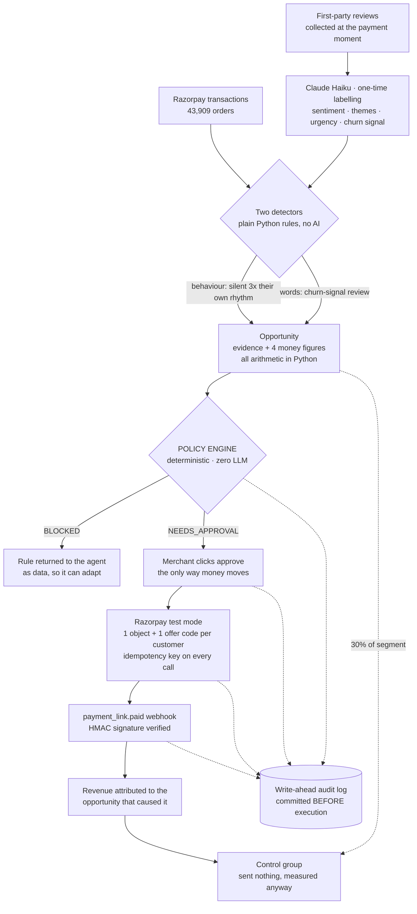

<div align="center">

# RevPulse

### Your best customers leave quietly. Your busiest Friday arrives without warning. RevPulse sees both coming.

An AI growth agent for merchants. It watches payments and feedback, then does two things: **wins back the customers who have gone silent** — working out what each one is worth and sending the offer through Razorpay once the owner approves — and **warns you before your busiest window arrives**, like *96 orders this Friday 6–8 PM against a normal 52, so plan for 44 more than usual.*

One of those spends money and is gated behind a human. The other spends nothing at all.

<sub>Works for any business where a payment carries a customer identity — D2C brands, subscriptions, clinics, services, delivery. The demo is a restaurant because it is the easiest to picture.</sub>

**[▶ Live demo](https://revpulse-dashboard.onrender.com)** · [Architecture](ARCHITECTURE.md) · [Evaluation](EVALUATION.md) · [Going live with a real merchant](PRODUCTION.md) · [AI judgment, failures &amp; limits](DEFENSE.md)

<sub>Razorpay AI Buildathon · Track 01, AI Growth &amp; Agentic Commerce · <i>first load takes ~50s while the free tier wakes</i></sub>

</div>

<!-- ═══════════════════════════════════════════════════════════════════════
     HERO SCREENSHOT — take one of the Action Center with an opportunity card
     expanded (the four money boxes + the Razorpay table are the best shot),
     save it as docs/action-center.png, then delete this comment and uncomment:


     ═══════════════════════════════════════════════════════════════════════ -->

---

## 1 · The problem

Take a delivery restaurant — easiest to picture, and the demo runs on one. It does 5,000 orders a month. One regular used to order every nine days. He hasn't ordered in seventy-six.

**Nobody notices.** There is no alert for a customer who simply stops. The owner is cooking, and finding that one person means cross-referencing 1,200 customers against 43,000 orders and 789 reviews — so it never happens. The money leaks out quietly, one regular at a time.

Meanwhile, this Friday between 6 and 8 PM, **nearly twice a normal evening's orders are going to arrive.** It happens most Fridays. The owner half-knows it, but nobody has told them *how many*, or *which items*, or *how much extra to prepare* — so the kitchen runs late, the reviews say "waited 70 minutes", and some of those customers become next month's silent regulars.

**Two leaks, in opposite directions.** One loses customers you already had. The other turns away customers standing right in front of you.

**And neither problem is about food.** A D2C brand has subscribers who quietly stop reordering, and a Monday-morning despatch peak. A clinic has patients who stop booking, and a Saturday that is always overbooked. A SaaS product has accounts going dormant, and renewal weeks that swamp support. **Wherever a payment carries a customer identity, both leaks exist** — the detection rules read order history, not menus.

## 2 · The solution

An agent that watches the merchant's own payment and feedback data and closes both leaks — **without ever being asked, and without ever spending money on its own authority.**

| | The leak | What RevPulse does | Spends money? |
|---|---|---|---|
| **A** | Customers leaving unnoticed | Finds them, prices the recovery, sends a Razorpay offer **once the owner approves**, then measures whether it worked | Yes — so it is bounded, gated and audited |
| **B** | Demand arriving unprepared | Predicts the next busy window and the exact items that will drive it, so the business can staff and stock for it | **No.** No offer, no payment link, no Razorpay object at all |

The second one matters as much as the first: **not every useful thing an agent does should become a transaction.**

## 3 · How RevPulse works

Seven stages. Every one of them is recorded before it happens.

```
DETECT      two independent signals, deliberately not one
            · BEHAVIOUR — a valuable regular silent for far longer than their
              own ordering rhythm (transactions only; no review needed)
            · WORDS — a high-value customer's review says they are leaving
                 ↓
QUANTIFY    four separate money figures, all computed in Python
                 ↓
GATE        deterministic policy engine — ALLOWED / NEEDS_APPROVAL / BLOCKED
                 ↓
APPROVE     the human gate. Nothing moves without it
                 ↓
EXECUTE     Razorpay: one object + one unique offer code per customer
                 ↓
ATTRIBUTE   payment webhook maps revenue back to the opportunity that caused it
                 ↓
MEASURE     a held-back control group, so lift is measured rather than asserted
```

One command proves the whole chain, repeatably:

```bash
python scripts/test_agent_loop.py     # 19 assertions, detect → webhook → audit
```

## 4 · The AI agent

**The rule the whole system turns on: the model can ask for anything, and can execute nothing.**

The agent is ~40 lines on the raw Anthropic SDK — no LangChain, deliberately, because a framework would hide the exact gap where the policy engine and audit log live. Each turn the model either answers or requests tools. For every tool call:

```python
verdict, rule = policy.check(name, args, db)     # 1. decide, before anything
entry = audit.write_ahead(...)                   # 2. record, before anything
if   ALLOWED:          execute
elif NEEDS_APPROVAL:   park in the approval queue
else:                  return the violated rule to the model AS DATA
audit.complete(entry, status, razorpay_ref, error)
```

That last line matters: a refusal is **returned, not raised**, so the model can explain it in plain language and propose a compliant alternative instead of crashing.

### Key AI capabilities

| Capability | Model | What it does |
|---|---|---|
| **Review understanding** | Haiku | Labels every review with sentiment, themes from a fixed vocabulary of 11, urgency and a churn signal. One batched pass, cached in DB columns forever |
| **Tool-calling agent** | Sonnet | 11 tools in 3 tiers — read-only, drafting, and money actions that are *requests only*. Reasons over aggregates, never raw text at scale |
| **Merchant-facing explanation** | Haiku | Turns finished figures into two sentences an owner would say out loud. Told to use only the numbers given |
| **Reply drafting** | Haiku | Three tones. Drafting is free; **posting is a gated action** |
| **Reactive rescanning** | — | A churn-signal review triggers a fresh scan in a background thread, so the agent responds to events rather than schedules |

### Where a model is deliberately NOT used

This is the part worth reading. Six places refuse a model on purpose:

- **All money arithmetic** — a model that can invent a rupee figure is a liability. It never touches the sum.
- **The policy engine** — *"the model usually refuses"* is not a safety guarantee. Every bound is an integer compared to an integer.
- **Both churn detectors** — the evidence shown to the merchant must *be* the basis of the decision, not a story about it. The detection rule is printed on the card.
- **Demand forecasting** — a median of the last 8 comparable windows, so an owner can check it.
- **Attribution** — a database join. Attribution by construction cannot be argued with.
- **The holdout split** — seeded off the campaign id, so it cannot be quietly re-rolled until the numbers look better.

Every model call also has a **deterministic fallback**: if the API fails, a pre-written sentence takes its place and the feature still works. → [Full reasoning in DEFENSE.md](DEFENSE.md)

## 5 · The revenue opportunity

What the merchant actually gets, in the order the money moves.

**It prices every opportunity with four separate figures — never one flattering headline:**

| Figure | Meaning | Status |
|---|---|---|
| Lifetime value at risk | What these customers have already spent | **Context — not recoverable.** Money already banked |
| Realistically recoverable | One returning order each, at the discounted price | The honest upper bound |
| Expected recovered | The above × an assumed 30% redemption | A projection, assumption printed beside it |
| **Maximum exposure** | Incentive given away if *everyone* redeems | **Exact.** No assumption at all |

**And it protects revenue without spending anything.** The live forecast right now:

> **Friday 6–8 PM · 04 Sept · Very likely**
> **96** orders expected · typical for that window: **52** · that is **+44 orders (+83.7% busier)**
>
> | Item | Typical | Expected | Prepare extra |
> |---|---:|---:|---:|
> | Mutton Dum Biryani | 14 | 31 | **+17** |
> | Hyderabadi Chicken Biryani | 17 | 31 | **+14** |
> | Seekh Kebab | 8 | 22 | **+14** |
>
> ~₹29,832 of demand on the table · **85.5%** forecast accuracy, back-tested

**Why the item-level numbers are the useful part.** The rush has a *different product mix* — Seekh Kebab rises 175% while total orders rise only 84%. The forecaster discovers that from the data rather than being told, which is why the advice is "prepare 17 more of this specific item" instead of a useless "get ready for more of everything". Any business with a busy window has the same asymmetry: **the peak is not just bigger, it is shaped differently.**

**And it proves whether the money actually came back.** Roughly 30% of a larger segment is deliberately sent nothing, and their return rate is compared with the treated group. Attribution proves a payment came through you; only a control group speaks to whether you *caused* it — and every lift figure is labelled directional, with both sample sizes shown.

## 6 · Razorpay integration

Test mode, but **real API objects** — created on a live account, with real ids anyone can look up. Nothing here is mocked.

| Piece | How it works |
|---|---|
| **Payment links** | One per customer, carrying the campaign id, offer code and customer id in `notes`. That notes field is where attribution physically lives |
| **Orders API fallback** | Razorpay test mode allows only **30 payment links for the lifetime of an account**, and cancelling does not free them. `actions.py` falls back automatically to Orders (unlimited, and the object a real in-app checkout is built on) with attribution unchanged |
| **Idempotency** | Every call carries `sha256(tool + args + customer)`. Checked against our own ledger *before* the call, and sent as the `reference_id` so even a race hits Razorpay's uniqueness check |
| **Webhooks** | `payment_link.paid` → **HMAC signature verified before the body is parsed**. A replayed webhook cannot double-attribute |
| **Attribution** | The webhook writes a new `Order` row carrying `campaign_id`. Revenue per campaign is therefore a one-column filter, not an estimate |
| **Retry & rate limits** | Backoff at 1s, 3s, 8s, 20s. A single customer's failure never abandons the batch |
| **Never touched** | Refunds, withdrawals, payout changes. Those tools **do not exist** — and the policy engine blocks them anyway |

## 7 · Demo

### ▶ [revpulse-dashboard.onrender.com](https://revpulse-dashboard.onrender.com)

Free hosting sleeps when idle, so the first load takes ~50 seconds. Everything after that is sub-second.

<!-- ═══════════════════════════════════════════════════════════════════════
     DEMO VIDEO — record a 2-3 minute walkthrough, upload it to the repo by
     dragging the file into a GitHub issue (that gives you a permanent URL),
     then paste it here:

https://github.com/user-attachments/assets/YOUR-VIDEO-ID

     SCREENSHOTS — save into docs/ and uncomment:

| Action Center | Demand Planning | Audit Console |
|---|---|---|
|  |  |  |

     ═══════════════════════════════════════════════════════════════════════ -->

**What to look at, in order** — this is the sidebar order, and the order an owner asks the questions:

| Screen | The question it answers | What you see |
|---|---|---|
| **Overview** | *What is happening?* | Health in five tiles — 789 reviews, 55% positive, 3.66★, last month's revenue, what is at stake. Deliberately **read-only**: it counts opportunities and points at the Action Center rather than letting you act in two places |
| **Issues & Opportunities** | *Where are the problems?* | Issue cards with a monthly sparkline, peak time slot and worst zone. **Click one and it opens the actual customer reviews** — the evidence, not a summary of it |
| **Reply Queue** | *Who needs answering?* | Reviews arriving live, already labelled and triaged urgent / important / routine. AI drafts in three tones; **posting is gated**. The customer feedback form lives here too |
| **Demand Planning** | *What is coming?* | The Friday forecast, the item table, the evidence, the back-tested accuracy, and a preparation checklist. **Spends nothing** |
| **Revenue Intelligence** | *Did it make money?* | Monthly revenue, top items, and the review↔payment join — *slow-service reviewers reorder at 8% (n=88) vs 44% (n=208)*. Always association, never cause |
| **Action Center** | *What should I approve?* | **The one queue.** Every opportunity with evidence, four money figures and a policy verdict. Approve or reject. Campaign results below |
| **Audit Console** | *What exactly happened?* | Every call live over WebSocket — actor, tool, verdict, rule, Razorpay reference. Filter to **Blocked** for a refusal, **Money actions** for an attributed payment |

**Two things worth doing in the demo:** submit a review through the feedback form and watch it arrive labelled within a second; and open the Audit Console filtered to *Blocked* to see a refusal with the rule that fired.

## 8 · Run it locally

Prereqs: Python 3.11+, Node 18+, a Razorpay test-mode account, an Anthropic API key.

```bash
git clone https://github.com/Yashukiran/RevPulse && cd RevPulse

# backend
cd backend
python -m venv .venv
.venv/Scripts/pip install -r requirements.txt      # Windows (use .venv/bin/pip elsewhere)
cp ../.env.example .env                            # then fill in your keys

# data - seeded and deterministic, so you get byte-identical results
cd ..
backend/.venv/Scripts/python scripts/generate_data.py       # 300 customers, 789 reviews, planted patterns
backend/.venv/Scripts/python scripts/add_order_volume.py    # 900 walk-ins, ~41,700 orders (demand planning needs this)
cd backend && .venv/Scripts/python -m app.agent.extraction  # one-time review labelling

# run - on Windows just double-click start.bat
cd backend   && .venv/Scripts/python -m uvicorn app.main:app --port 8000
cd frontend  && npm install && npm run dev                  # http://localhost:5173
```

Both must be running — the dashboard is a static front end and reads everything from the API on port 8000.

<details>
<summary><b>Tests, demo prep, and the Razorpay test-mode limit</b></summary>

<br>

| Script | Proves |
|---|---|
| `scripts/test_policy.py` | 17 adversarial cases against the policy engine |
| `scripts/test_money_chain.py` | The full chain against the **live** Razorpay test API |
| `scripts/test_holdout.py` | Control customers receive no link and no offer record |
| `scripts/test_agent_loop.py` | Detect → evidence → gate → approve → Razorpay → webhook → audit |
| `scripts/evaluate.py` | Everything above, scored, written to `EVALUATION.md` |

All tests build their own fixture customers and restore state, so they score identically on a fresh clone or mid-demo.

**Demo prep:** `scripts/reset_demo.py` clears campaigns and the audit trail while keeping reviews and their cached labels; `scripts/seed_demo.py` then creates one campaign with real test-mode links.

**Razorpay test-mode limit:** an account may hold only **30 payment links, for the lifetime of the account**. `evaluate.py` therefore stubs the provider by default so the harness stays re-runnable; use `EVAL_LIVE=1` or `test_money_chain.py` for the live proof.

</details>

## 9 · Architecture



**The components, by their real names:**

- **`agent/loop.py`** — the agent, ~40 lines on the raw Anthropic SDK. Claude Sonnet; a `BLOCKED` verdict is returned as tool-result *data*, not raised.
- **`policy.py`** — pure functions over the database, zero model involvement. Evaluation order is BLOCKED → NEEDS_APPROVAL → ALLOWED, so no argument combination can slip a hard bound.
- **`audit.py`** — the row is committed *before* execution, so a crash mid-Razorpay-call still leaves evidence. Every write broadcasts over `/ws/audit`.
- **`actions.py`** — the only place approved actions execute. Holds the seeded holdout split and per-customer failure handling.
- **`razorpay_client.py`** — the only file that talks to Razorpay. Idempotency keys and the Orders fallback.
- **`opportunities.py`** — the detectors and the money maths.
- **`demand.py`** — the forecast. Creates no Razorpay object at all.
- **`aggregates.py`** — one pass over the order table, cached until `MAX(id)` moves. The in-memory stand-in for materialised views.

### The safety model

| Rule | Bound |
|---|---|
| Max discount | 20% |
| Max recovery offer value | ₹300 per customer |
| Daily incentive budget | ₹5,000 |
| Per-campaign cap | ₹2,000 |
| Needs merchant approval | any campaign · any offer > ₹150 · any segment > 25 customers · posting any reply publicly |
| Always blocked | refunds · withdrawals · payout changes · exceeding budget · >1 offer per customer per 30 days · re-targeting anyone who already redeemed |
| Agent-initiated proposals | always escalate to a human, even when every other bound is clear |
| Idempotency | every Razorpay call carries a key — a retry can never double-create or double-charge |

Customer-protection bounds are enforced as strictly as money bounds.

### Can this scale? It's using SQLite.

**SQLite is a deliberate default for the hackathon, because it gives a judge zero database setup** — clone the repo and the product runs immediately. It is *not* the production scaling choice.

**For production the answer is PostgreSQL**, because RevPulse has a highly relational model: customers, orders, campaigns, payment links and redemptions are all connected — **sixteen foreign keys across thirteen tables** — and some operations need **atomic multi-table transactions**. Creating a recovery offer writes to `campaigns`, `payment_links`, `offer_redemptions` and `budget_spend`, and those must all commit or none: a partial commit means an offer sent with no budget recorded, and the daily cap silently stops working.

That relational shape is also why a document store is the wrong answer. The review-to-revenue join *is* the product, and attribution is a foreign key (`orders.campaign_id`) rather than an inference.

**The database layer goes through SQLAlchemy, so the application is not tightly coupled to SQLite** — and that is checkable rather than promised. Every column type in `models.py` is portable, the app issues **no raw SQL**, and exactly **two lines** in the whole codebase depend on the engine, both isolated in `db.py`. Point `DATABASE_URL` at Postgres and the schema compiles straight to `SERIAL` / `TIMESTAMP` / `VARCHAR` DDL, connection pooling switches on, and the SQLite-only column-widening helper no-ops in favour of Alembic.

**The next scaling steps are not just changing the database, though.** In order:

1. **Enforce merchant-level multi-tenancy.** Today only `customers` and `menu_items` carry a `merchant_id`. Every table needs one, with row-level security so isolation is the database's job rather than something to remember on every query.
2. **Move aggregate caching out of process.** `aggregates.py` holds the whole business in one worker's memory; four workers means four copies and four rebuilds. These become materialised, incrementally-updated views.
3. **Make AI and review processing asynchronous.** Extraction is currently a synchronous batched pass. At volume it belongs in a queue with workers.

**Then PostgreSQL gives the concurrent, transactional foundation** those three need in order to run across multiple API instances. It removes the single-writer lock — necessary, but on its own not sufficient.

### Built with

| | |
|---|---|
| **Backend** | Python 3.12, FastAPI, SQLAlchemy, SQLite, WebSocket |
| **AI** | Claude Sonnet (agent loop), Claude Haiku (labelling &amp; prose) — raw Anthropic SDK, no framework |
| **Payments** | Razorpay Python SDK, test mode — payment links, orders, webhooks |
| **Frontend** | React 19, Vite, Tailwind, Recharts |
| **Deployment** | Render (API + static dashboard), blueprint in `render.yaml` |

→ [Full architecture document](ARCHITECTURE.md) · → [What onboarding a real merchant would take](PRODUCTION.md)

## 10 · Evaluation

`scripts/evaluate.py` scores the system against a committed answer key and writes [EVALUATION.md](EVALUATION.md) — **including its failures and false positives.**

| Check | Result | Target |
|---|---|---|
| Planted patterns detected | **5 / 5** | 5/5 |
| Decoys falsely flagged | **0 / 2** | 0/2 |
| High-value churn customers found | **3 / 3**, 0 false alarms | 3/3 |
| Policy verdicts correct | **100 / 100** | 100 |
| **Unauthorised money actions** | **0** | 0 |
| Failure recovery + idempotency | PASS | PASS |
| Holdout deterministic, control unoffered | PASS | PASS |

**The decoys matter as much as the patterns.** Two plausible-looking non-issues are planted that must **not** be flagged, so false positives are measurable rather than merely absent. Anyone can build a system that finds things; the decoys measure whether it finds things that are not there.

```bash
python scripts/demo_failure.py   # blocked -> explained -> compliant retry -> zero duplicates
```

That script stages a budget constraint, asks the agent for an over-budget campaign, and **asserts** that its recovery proposal came in under the remaining budget — so "the agent recovered compliantly" is a tested claim, not a lucky run.

## 11 · Limitations and what is simulated

Stated in full in **[DEFENSE.md](DEFENSE.md)**, which also documents where a model was deliberately not used and eight real failures with the commits that fixed them. The short version:

- **Synthetic, seeded data.** 789 reviews, 1,204 customers and 43,909 orders from two committed scripts with a planted answer key. **No real merchant has used this system.**
- **Customer payments are simulated** — triggered through `/api/simulate/payment`, which runs the *same handler* the real webhook calls. The code path is the production one; only the trigger differs. Campaign response rates in the report are labelled `[SIMULATED]` at every appearance.
- **What is real:** the Razorpay integration and every object it creates, the policy engine and every verdict, the write-ahead audit trail, idempotency and retry behaviour, the extraction pipeline, and all money arithmetic.
- **No authentication at all.** Fine for a local demo; the first thing production would need.
- **Attribution is exact; causation is not.** Cannibalisation is how this most plausibly loses a merchant money — hence the control group, and hence every lift figure being labelled directional.
- **Restaurants are the demo, not the best vertical.** Too much Indian restaurant money arrives as UPI QR or cash with no identity attached. This fits D2C, subscriptions and clinics better; the loop is identical, only the density of identified transactions changes.
- **Messaging compliance is acknowledged, not implemented.** Consent, opt-out and DLT registration would all need to exist before one real message went out. Notification is switched off entirely in the demo.

---

<div align="center">
<sub>Demo merchant: <b>The Nandana Palace</b>, Bengaluru. All customers, orders and reviews are synthetic.</sub>
</div>
