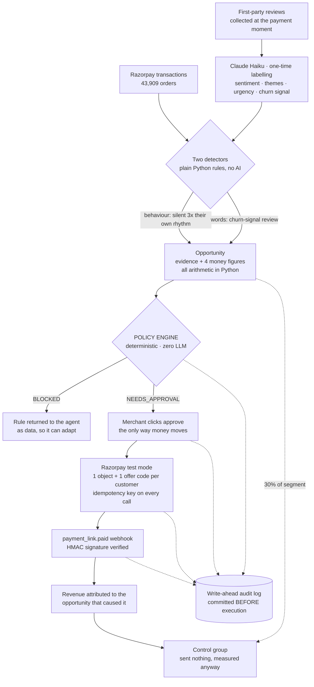

<div align="center">

# RevPulse

### Your best customers leave quietly. Your busiest Friday arrives without warning. RevPulse sees both coming.

An AI growth agent for merchants. It watches payments and feedback, then does two things: **wins back the regulars who have gone silent** — working out what each one is worth and sending the offer through Razorpay once the owner approves — and **tells the kitchen what is about to hit them**, like *96 orders this Friday 6–8 PM against a normal 52, so prepare 17 more mutton biryanis.*

One of those spends money and is gated behind a human. The other spends nothing at all.

**[▶ Live demo](https://revpulse-dashboard.onrender.com)** · [Architecture](ARCHITECTURE.md) · [Evaluation](EVALUATION.md) · [What's wrong with it](DEFENSE.md)

<sub>Razorpay AI Buildathon · Track 01, AI Growth & Agentic Commerce · <i>first load takes ~50s while the free tier wakes</i></sub>

</div>

<!-- ─────────────────────────────────────────────────────────────────────
     SCREENSHOT SLOT — add a dashboard screenshot here and uncomment:
     
     Save PNGs into docs/ and reference them relatively.
     ───────────────────────────────────────────────────────────────────── -->

---

## The problem

A restaurant does 5,000 orders a month. One regular used to order every nine days. He hasn't ordered in seventy-six.

**Nobody notices.** There is no alert for a customer who simply stops. The owner is cooking, and finding that one person means cross-referencing 1,200 customers against 43,000 orders and 789 reviews — so it never happens. The money leaks out quietly, one regular at a time.

Meanwhile, this Friday between 6 and 8 PM, **nearly twice a normal evening's orders are going to arrive.** It happens most Fridays. The owner half-knows it, but nobody has told them *how many*, or *which dishes*, or *how much extra to prep* — so the kitchen runs late, the reviews say "waited 70 minutes", and some of those customers become next month's silent regulars.

**Two leaks, in opposite directions.** One loses customers you already had. The other turns away customers standing right in front of you. RevPulse closes both.

## What it does

**Nobody asks it anything.** It scans on startup, and again the moment a new review signals someone is unhappy. When it finds a customer worth saving it writes up a card — the evidence, what the relationship is worth, what an offer can realistically recover, and the most that offer could cost — and puts it on the owner's desk.

Then it stops and waits. **Money only moves when a human clicks approve.**

## How it actually grows revenue

Two capabilities. The first recovers money you have lost; the second protects money you are about to lose.

---

### A · Winning back the customers who left

Four steps, and each one is a number you can check:

**1 · It finds who is leaving — two ways.**
Most customers never write a review, so payment behaviour is the primary signal: a regular silent for more than **3× their own ordering rhythm**. The second signal is their own words — a review saying they are leaving — which is rarer but explains *why*, and shapes what you say to them.

**2 · It prices the opportunity honestly.**
Four separate figures, never collapsed into one flattering headline:

| Figure | What it means |
|---|---|
| Lifetime value at risk | What they have already spent. **Context — not recoverable** |
| Realistically recoverable | One returning order each, at the discounted price |
| Expected recovered | A projection, with its assumption printed beside it |
| **Maximum exposure** | **Exact.** What it costs if every customer redeems |

**3 · The owner approves, and Razorpay does the rest.**
Each customer gets **their own Razorpay object and their own offer code**. So when a payment lands, it maps back to that campaign **by construction — not by estimate**.

**4 · It proves whether it worked.**
About 30% of a larger segment is deliberately sent **nothing**. Their return rate is compared with the customers who got the offer, so lift is *measured against a control group* rather than asserted. Attribution proves the payment came through you; only a holdout speaks to whether you caused it.

---

### B · Telling the kitchen what is about to hit them

This half **spends nothing**. No offer, no payment link, no Razorpay object at all — and that is deliberate. Not every useful thing an agent does should become a transaction.

It reads the order history and finds the window that reliably runs busier than a normal day. Right now, for the demo merchant:

> **Friday 6–8 PM · 04 Sept · Very likely**
> **96** orders expected · typical for that window: **52** · that is **+44 orders (+83.7% busier)**
>
> | Dish | Typical | Expected | Prepare extra |
> |---|---:|---:|---:|
> | Mutton Dum Biryani | 14 | 31 | **+17** |
> | Hyderabadi Chicken Biryani | 17 | 31 | **+14** |
> | Seekh Kebab | 8 | 22 | **+14** |
>
> *"Prepare about 17 extra Mutton Dum Biryani · keep packaging ready for roughly 44 additional orders · check delivery capacity before the rush starts."*

**Why the dish-level numbers are the useful part.** The Friday rush has a *different menu mix* — Seekh Kebab rises 175% while total orders rise 84%. The forecaster discovers that rather than being told, which is why the advice is "prepare 17 more mutton biryanis" instead of a useless "prepare more of everything".

**And it does not overclaim.** The forecast is the median of the last 8 comparable Fridays, so it is explainable rather than a black box. Accuracy is **85.5%**, measured by re-forecasting past Fridays using only the data available before each one. Where slow-service complaints cluster in that window it says so in *percentage points* and calls it an association, never a cause. The button saves a preparation plan and says so — nothing is ordered, booked or charged.

## Features

- ✅ **Proactive growth agent** — scans unprompted, raises opportunities with evidence, money maths and a policy verdict already attached
- ✅ **Two churn detectors** — transaction behaviour (works for 100% of customers) and review language (explains why)
- ✅ **Real Razorpay money loop** — test-mode payment links and orders, unique offer code per customer, webhook attribution
- ✅ **Deterministic policy engine** — every money action bounded, gated and refusable, with no model involved
- ✅ **Write-ahead audit trail** — every step recorded *before* it happens, streamed live over WebSocket
- ✅ **Holdout control groups** — incrementality measured, and labelled directional when the sample is too small
- ✅ **Demand planning** — next busy window, dish-level quantities, back-tested accuracy, spends nothing
- ✅ **Review intelligence** — themes, trends, time and zone concentration, with click-through to the actual reviews
- ✅ **Reply queue** — feedback arrives live, already labelled and triaged; AI drafts in 3 tones, posting is gated
- ✅ **Evaluation harness** — scores itself against planted ground truth and writes down its own failures

## The seven screens — what each one is for

Open the **[live demo](https://revpulse-dashboard.onrender.com)** and follow along; this is the order the sidebar is in, and it is the order an owner actually asks the questions.

| Screen | The question it answers | What you see |
|---|---|---|
| **Overview** | *What is happening?* | Business health in five tiles — 789 reviews, 55% positive, 3.66★, last month's revenue, and how much is at stake right now. Four charts behind them. Deliberately **read-only**: it counts opportunities and points at the Action Center rather than letting you act in two places. |
| **Issues & Opportunities** | *Where are the problems?* | Four issue cards with a monthly sparkline, the peak time slot and the worst delivery zone. **Click one and it opens the actual customer reviews** — the evidence, not a summary of the evidence. |
| **Reply Queue** | *Who needs answering?* | Reviews as they arrive, already labelled and sorted into urgent / important / routine. AI drafts a reply in three tones — but **posting is a gated action**, because words leaving the building are an external action. The customer-facing feedback form lives here too, so receiving and answering happen in one place. |
| **Demand Planning** | *What is coming?* | The Friday forecast above: expected vs typical orders, the dish table, the evidence behind it, the back-tested accuracy, and a preparation checklist. **Spends nothing.** |
| **Revenue Intelligence** | *Did it make money?* | Monthly revenue, top items by revenue, and the join between reviews and payments — *customers mentioning slow service reorder at 8% (n=88) vs 44% for everyone else (n=208)*. Both sample sizes always on screen, always labelled association rather than cause. |
| **Action Center** | *What should I approve?* | **The one queue.** Every opportunity the agent found, with its evidence, four money figures and policy verdict. Approve or reject. Below that: pending approvals, and campaign results with revenue attributed and incentive actually spent. |
| **Audit Console** | *What exactly happened?* | Every call the agent made, live over WebSocket — time, actor, tool, verdict, the rule that fired, the Razorpay reference. Filter to **Blocked** to see a refusal, or **Money actions** to see a payment attributed back to the opportunity that caused it. |

## How it works

RevPulse is an ordinary FastAPI service with one unusual rule: **the language model can request anything, and execute nothing.** Between the model asking and money moving sits a deterministic policy engine and a write-ahead log.



**The components, by their real names:**

- **`agent/loop.py`** — the agent itself, ~40 lines on the raw Anthropic SDK. No LangChain: a framework would hide the exact gap where the policy engine and audit log live. Claude Sonnet drives the loop; a `BLOCKED` verdict is returned as tool-result *data*, not raised, so the model can explain the refusal and propose a compliant alternative.
- **`policy.py`** — pure functions over the database, zero model involvement. Order of evaluation is BLOCKED → NEEDS_APPROVAL → ALLOWED, so no argument combination can slip a hard bound.
- **`audit.py`** — the row is committed *before* execution, so a crash mid-Razorpay-call still leaves evidence. Every write broadcasts over `/ws/audit`.
- **`actions.py`** — the only place approved actions execute. Holds the holdout split (seeded off the campaign id, so it cannot be quietly re-rolled) and per-customer failure handling.
- **`razorpay_client.py`** — the only file that talks to Razorpay. Idempotency key is `sha256(tool + args + customer)`, checked against our own ledger *before* the call and sent as the `reference_id`.
- **`opportunities.py`** — the detectors and the money maths. The model receives finished figures and writes two sentences; if that call fails, a deterministic sentence takes its place and the card still works.
- **`aggregates.py`** — one pass over the order table, cached until `MAX(id)` moves. The in-memory stand-in for materialised views.

## The safety model

**The LLM never touches Razorpay.** Every money-touching request passes through `backend/app/policy.py`, which returns `ALLOWED`, `NEEDS_APPROVAL` or `BLOCKED` plus the exact rule that fired.

| Rule | Bound |
|---|---|
| Max discount | 20% |
| Max recovery offer value | ₹300 per customer |
| Daily incentive budget | ₹5,000 |
| Per-campaign cap | ₹2,000 |
| Needs merchant approval | any campaign · any offer > ₹150 · any segment > 25 customers · posting any reply publicly |
| Always blocked | refunds · withdrawals · payout changes · exceeding budget · >1 offer per customer per 30 days · re-targeting anyone who already redeemed |
| Agent-initiated proposals | always escalate to a human, even when every other bound is clear |
| Idempotency | every Razorpay call carries a key — a retry can never double-create or double-charge |

Customer-protection bounds are enforced as strictly as money bounds. Refund, withdrawal and payout tools **do not exist** — and are blocked anyway. Defence in depth.

## Proof, not claims

`scripts/evaluate.py` scores the system against a committed answer key and writes [EVALUATION.md](EVALUATION.md) — **including its failures and false positives.**

| Check | Result |
|---|---|
| Planted patterns detected | **5 / 5** |
| Decoys falsely flagged | **0 / 2** |
| High-value churn customers found | **3 / 3**, 0 false alarms |
| Policy verdicts correct | **100 / 100** |
| **Unauthorised money actions** | **0** |
| Failure recovery + idempotency | PASS |

The decoys matter as much as the patterns: two plausible-looking non-issues are planted that must **not** be flagged, so false positives are measurable rather than merely absent.

```bash
python scripts/test_agent_loop.py   # the whole money loop, end to end, 19 assertions
python scripts/demo_failure.py      # blocked -> explained -> compliant retry -> zero duplicates
```

## Built with

| | |
|---|---|
| **Backend** | Python 3.12, FastAPI, SQLAlchemy, SQLite, WebSocket |
| **AI** | Claude Sonnet (agent loop), Claude Haiku (labelling & prose) — raw Anthropic SDK, no framework |
| **Payments** | Razorpay Python SDK, test mode — payment links, orders, webhooks |
| **Frontend** | React 19, Vite, Tailwind, Recharts |
| **Deployment** | Render (API + static dashboard), blueprint in `render.yaml` |

## Quick start

Prereqs: Python 3.11+, Node 18+, a Razorpay test-mode account, an Anthropic API key.

```bash
git clone https://github.com/Yashukiran/RevPulse && cd RevPulse

# backend
cd backend
python -m venv .venv
.venv/Scripts/pip install -r requirements.txt      # Windows (use .venv/bin/pip elsewhere)
cp ../.env.example .env                            # then fill in your keys

# data - seeded and deterministic, so you get byte-identical results
cd ..
backend/.venv/Scripts/python scripts/generate_data.py       # 300 customers, 789 reviews, planted patterns
backend/.venv/Scripts/python scripts/add_order_volume.py    # 900 walk-ins, ~41,700 orders (demand planning needs this)
cd backend && .venv/Scripts/python -m app.agent.extraction  # one-time review labelling

# run - on Windows just double-click start.bat
cd backend   && .venv/Scripts/python -m uvicorn app.main:app --port 8000
cd frontend  && npm install && npm run dev                  # http://localhost:5173
```

Both must be running — the dashboard is a static front end and reads everything from the API on port 8000.

<details>
<summary><b>Tests, demo prep, and the Razorpay test-mode limit</b></summary>

<br>

| Script | Proves |
|---|---|
| `scripts/test_policy.py` | 17 adversarial cases against the policy engine |
| `scripts/test_money_chain.py` | The full chain against the **live** Razorpay test API |
| `scripts/test_holdout.py` | Control customers receive no link and no offer record |
| `scripts/test_agent_loop.py` | Detect → evidence → gate → approve → Razorpay → webhook → audit |
| `scripts/evaluate.py` | Everything above, scored, written to `EVALUATION.md` |

All tests build their own fixture customers and restore state, so they score identically on a fresh clone or mid-demo.

**Demo prep:** `scripts/reset_demo.py` clears campaigns and the audit trail while keeping reviews and their cached labels; `scripts/seed_demo.py` then creates one campaign with real test-mode links.

**Razorpay test-mode limit:** an account may hold only **30 payment links, for the lifetime of the account** — cancelling does not free them. `actions.py` therefore falls back automatically to the Orders API, and `evaluate.py` stubs the provider call by default so the harness stays re-runnable. Use `EVAL_LIVE=1` or `test_money_chain.py` for the live proof.

</details>

## The data — and the honest story

There is no external dataset. Two committed, seeded scripts build it, so the whole thing is reproducible byte for byte.

`generate_data.py` creates 300 reviewing customers and 789 reviews with **planted, answer-keyed patterns** — plus two decoys that must not be flagged. `add_order_volume.py` then adds 900 walk-in customers who never review, bringing the business to **43,909 orders** across 8 months with a real restaurant's shape: quiet Mondays, heavy Friday and Saturday evenings, and a *different menu mix* at the weekend rush. Everything money-shaped goes through the real Razorpay test-mode API.

**Where do reviews come from in production?** First-party feedback collected at the payment moment — after each successful Razorpay payment the customer gets a feedback link tied to that transaction. That joins every review to a customer *and* an order by construction, which is what makes review↔revenue analysis possible at all. Public platform reviews are anonymous and unmatchable.

## What isn't built

[DEFENSE.md](DEFENSE.md) states the limits in full, before anyone else has to. The short version:

- **Synthetic, seeded data.** No real merchant has used this.
- **Customer payments are simulated** — but through the *same handler* the real webhook calls.
- **No authentication at all.** Fine for a local demo; the first thing production would need.
- **Attribution is exact; causation is not.** Cannibalisation is how this most plausibly loses a merchant money, which is why there is a control group — and why every lift figure is labelled directional.
- **Restaurants are the demo, not the best vertical.** Too much Indian restaurant money arrives as UPI QR or cash with no identity attached. This fits D2C, subscriptions and clinics better; the loop is identical, only the density of identified transactions changes.
- **Messaging compliance is acknowledged, not implemented.** Consent, opt-out and DLT registration would all need to exist before one real message went out.

---

<div align="center">
<sub>Demo merchant: <b>The Nandana Palace</b>, Bengaluru. All customers, orders and reviews are synthetic.</sub>
</div>
