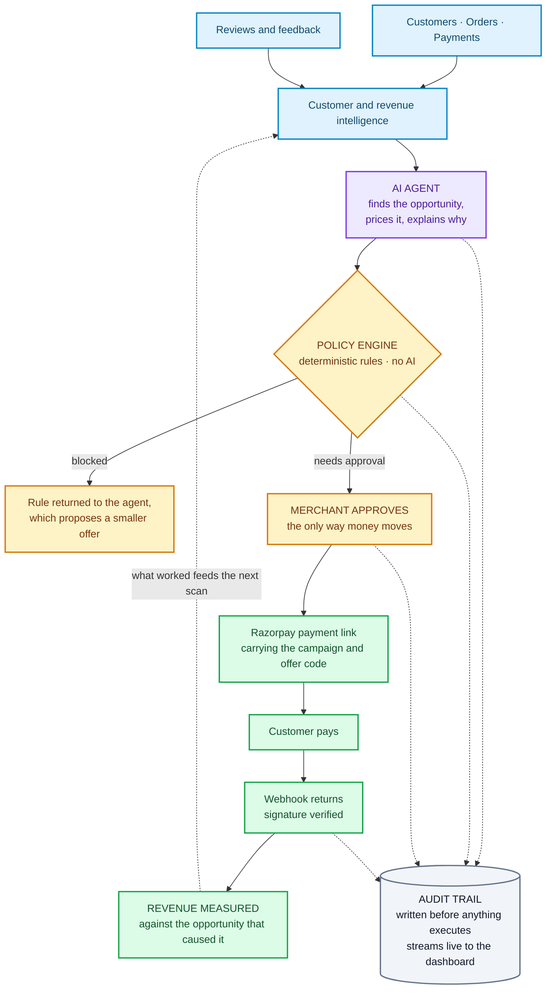

<div align="center">

# RevPulse

### AI that finds the revenue a merchant is about to lose — and helps recover it.

RevPulse reads a merchant's own customers, orders and feedback, and turns them into **revenue opportunities: who to act on, why, what to do, and what it is worth.** The merchant approves with one click, RevPulse creates the Razorpay payment link, and when the customer pays, that money is tied back to the opportunity that started it.

**Not a dashboard that reports. An agent that finds, acts, and measures.**

### [▶ Open the live demo](https://revpulse-dashboard.onrender.com)

<sub>Razorpay AI Buildathon · Track 01 · <i>first load takes ~50s while the free tier wakes</i></sub>

</div>

<!-- SCREENSHOT — Action Center with an opportunity card expanded. Save to
     docs/action-center.png and uncomment:   -->

---

## 1 · The problem

There is a restaurant in Bengaluru doing **5,072 orders a month.**

One of its regulars is Manish. He ordered every 25 days, like clockwork, six times over. Then he stopped.

**Nothing happened.** No alert. No red number on any screen. The kitchen was busy, the tickets kept printing, and this month's revenue still looked healthy — because it *was* healthy. Manish is worth **₹5,540**, and against ₹25.5 lakh of monthly revenue that is **0.22%.** Invisible in any report ever written.

Seventy-nine days later, nobody has called him. He has found somewhere else to eat.

> ### That is the whole problem. Revenue does not leave loudly — it leaks, one good customer at a time, and every report says you are fine.

Could the owner have caught it? Only by knowing that *Manish specifically* orders every 25 days — his own rhythm, not an average — and noticing he was three times past due. Now do that for **1,204 customers across 43,909 orders**, every day, while running a kitchen.

Nobody does that by hand. So it never gets done, and the money quietly walks.

## 2 · What RevPulse does

Every merchant already owns the data that would catch this. It sits in their payments, their order history, their reviews. The gap is not data — it is that **a report tells you what happened, and then stops.**

```
Dashboard    DATA ──► REPORT ──► the owner still has to work out what to do

RevPulse     DATA ──► AI REASONING ──► REVENUE OPPORTUNITY ──► ACTION ──► MEASUREMENT
```

RevPulse reads what the merchant already has — **purchase behaviour, transaction history, customer reviews, demand patterns and past campaign results** — and continuously answers four questions a report never does:

- **Who needs attention** — this specific customer, by name
- **Why they matter** — the evidence, in rupees
- **What to do about it** — a concrete, priced action
- **What it is worth** — and what it could cost if it goes wrong

Then it does the one thing dashboards never do: **it carries the action through to the payment, and measures whether the money actually came back.**

---

# 3 · Find Revenue Opportunities

**This is the product.** A merchant does not need another chart. They need to know where next month's revenue is quietly disappearing, and what to do about it today.

RevPulse finds **valuable customers whose buying pattern has broken** — someone who ordered like clockwork and has now been silent far longer than *their own* normal rhythm. Not a churn score. Not a segment. A named person, with the evidence that flagged them attached.

**This is a real opportunity from the live demo — the agent found it unprompted:**

> ### A high-value customer has gone quiet
> **Manish Pillai** · Koramangala · lifetime value **₹5,540** · average order **₹923**
>
> Ordered **6 times**, typically every **25 days**. Last order was **79 days ago** — **3.2× his own normal gap.**
>
> | | | |
> |---|---|---|
> | Lifetime value at risk | **₹5,540** | What he has already spent. Context — **not** recoverable |
> | Realistically recoverable | one returning order | The honest ceiling |
> | Expected recovered | **₹236** | A **projection**, at an assumed 30% redemption |
> | **Maximum exposure** | **₹138** | The most this can possibly cost. **Exact** |
>
> **Recommended action** — a 15% win-back offer, sent as a Razorpay payment link.
> **Policy verdict** — needs merchant approval.

### Why four numbers instead of one

Because a single flattering headline is how a tool like this loses a merchant's trust the first time reality disagrees with it.

**What is known** — ₹5,540 of lifetime value is banked history. ₹138 of maximum exposure is arithmetic: the most this can cost even if every customer redeems.

**What is projected** — ₹236 expected recovery assumes a 30% redemption rate, and RevPulse prints that assumption right beside the number. It even states that this merchant has no completed win-back campaigns yet to calibrate against.

An owner deciding whether to approve needs the **worst case** as hard as the upside. RevPulse gives them both, and never dresses one up as the other.

### The loop the merchant sees

```
Customer behaviour changes — silent far past their own rhythm
        ↓
Opportunity detected — with the evidence that triggered it
        ↓
Revenue potential priced — what is known, separated from what is projected
        ↓
Action recommended — a specific offer, at a specific discount
        ↓
Merchant approves — one queue, approve or reject
        ↓
Razorpay sends it — and the returning payment is measured against this card
```

Everything lands in **one place**: the Action Center. Every opportunity carries its evidence, its four figures and its policy verdict, and the merchant either approves it or rejects it. No hunting across screens, no acting in two places.

## 4 · The AI agent

**The agent works without being asked.** It scans the merchant's data when the system starts, and again the moment new feedback suggests a customer is unhappy. Nobody types a prompt.

For each run, it reads the data through its tools, assembles the evidence, prices the opportunity, and writes the recommendation in language an owner would actually use — always saying *why* it reached that conclusion, with the counts and gaps it relied on shown on the card.

Then it stops. Because of one rule:

> ## The model can ask for anything. It can never execute a money action.

Between the agent's intent and any rupee moving sits a **deterministic policy engine** — ordinary business rules written in code, with no AI in them at all:

| | |
|---|---|
| **Hard caps** | 20% max discount · ₹300 per customer · ₹2,000 per campaign · ₹5,000 per day |
| **Always needs approval** | any campaign · any offer over ₹150 · any segment over 25 customers · posting any public reply |
| **Always blocked** | refunds · withdrawals · payout changes · more than one offer per customer per 30 days |
| **Agent-initiated ideas** | always escalate to a human, even when every other rule is clear |

Every decision — allowed, blocked, or parked for approval — is recorded **before** anything executes and streams live to the dashboard, so the merchant can watch exactly what the agent did and why. When a request is blocked, the rule is handed back to the agent as data: it explains the limit to the merchant in plain language and proposes a smaller, compliant alternative instead of simply failing.

> **AI reasons · Policy controls · The merchant decides · Razorpay executes**

## 5 · Razorpay closes the loop

This is the part that makes RevPulse a revenue product rather than an analytics one. **The insight does not stop at a recommendation — it becomes a payment, and the payment comes back as measured revenue.**

```
Opportunity found
     ↓
Merchant approves
     ↓
Razorpay payment link created — one per customer, carrying the campaign id,
offer code and customer id
     ↓
Customer pays
     ↓
Payment webhook returns — HMAC signature verified before anything is trusted
     ↓
Revenue written back against the opportunity that caused it
```

**Attribution is exact, not estimated.** The returning order physically carries the campaign id, so "how much did this opportunity earn?" is a database lookup rather than a guess. Every call is idempotent, so a retry can never double-charge a customer. And on larger segments, a slice is deliberately sent nothing at all — so the campaign can be compared against customers treated identically apart from the offer itself.

The Razorpay objects are **real, created on a live test-mode account** — payment links with real ids, plus an automatic fallback to the Orders API. The customer *paying* is simulated in the demo, triggered through the same handler the real webhook calls.

> ### From insight, to payment, to measurable revenue — in one loop.

## 6 · How it all fits together



**Read it in one line:** the merchant's own data becomes an opportunity, the opportunity passes a rulebook the AI cannot argue with, the merchant approves, Razorpay executes, and the money that comes back is tied to the card that started it — while every step writes itself down before it happens.

## 7 · It also sees demand coming

Not every useful thing an agent does should become a transaction. RevPulse's second capability spends **nothing** — no offer, no payment link, no Razorpay object at all.

> **Friday 4 Sept, 6–8 PM · High confidence**
> **96 orders expected** against a typical **52** — that is **+44 orders (+84%)**, about **₹29,832** of demand.
>
> Prepare extra: **Mutton Dum Biryani +17** · **Hyderabadi Chicken Biryani +14** · **Seekh Kebab +14**
>
> **85.5% accuracy**, back-tested by predicting past Fridays it had never seen.

The useful part is the item detail. The rush is not just bigger, it is **shaped differently** — Seekh Kebab rises 175% while total orders rise 84%. That is the difference between "get ready for a busy night" and "prepare 17 more of this specific dish."

Revenue protected, without spending a rupee to protect it.

## 8 · See it in action

### ▶ **[revpulse-dashboard.onrender.com](https://revpulse-dashboard.onrender.com)**

**Sixty seconds, three clicks:**

1. **Action Center** — open the opportunity. Read the evidence, the four money figures, the policy verdict. Approve it and watch the Razorpay objects appear.
2. **Audit Console** — filter to **Blocked** and watch the agent get refused, with the exact rule that stopped it.
3. **Demand Planning** — the Friday forecast, the item-level prep list, and the accuracy it was back-tested at.

## 9 · Honest limitations

- The demo runs on **synthetic, seeded data** — 1,204 customers and 43,909 orders from committed generator scripts. No real merchant has used this yet.
- **Razorpay is in test mode**, and customer payments are simulated through the same webhook handler real ones use — the Razorpay objects are real, the paying customer is not.
- **There is no authentication**, and merchant onboarding is not built — this is a single-merchant demo, not a multi-tenant product.

## 10 · Built with

| | |
|---|---|
| **Frontend** | React · Vite · Tailwind |
| **Backend** | FastAPI · Python |
| **Database** | SQLite |
| **AI** | Anthropic Claude |
| **Payments** | Razorpay |
| **Deployment** | Render |

---

<div align="center">

Technical deep dive: **[ARCHITECTURE.md](ARCHITECTURE.md)** · **[DEFENSE.md](DEFENSE.md)** · **[EVALUATION.md](EVALUATION.md)**

<sub>Demo merchant: <b>The Nandana Palace</b>, Bengaluru. All customers, orders and reviews are synthetic.</sub>

</div>
