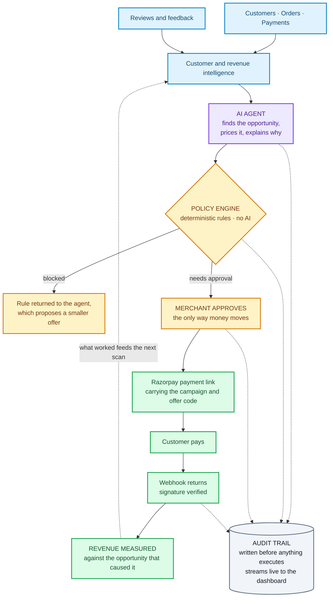

<div align="center">

# RevPulse

### AI that finds the revenue a merchant is about to lose — and helps recover it.

RevPulse reads a merchant's own customers, orders and feedback, and turns them into **revenue opportunities: who to act on, why, what to do, and what it is worth.** The merchant approves with one click, RevPulse creates the Razorpay payment link, and when the customer pays, that money is tied back to the opportunity that started it.

**Not a dashboard that reports. An agent that finds, acts, and measures.**

### [▶ Open the live demo](https://revpulse-dashboard.onrender.com)

<sub>Razorpay AI Buildathon · Track 01 · <i>first load takes ~50s while the free tier wakes</i></sub>

</div>

<!-- SCREENSHOT — Action Center with an opportunity card expanded. Save to
     docs/action-center.png and uncomment:   -->

---

## 1 · The problem


**It is never a clean break, which is exactly why it is missed.** Take a real customer from the demo data. His gaps between orders ran **13 days, then 25, then 41, then 23, then 38** — the rhythm stretching out order by order — and then nothing at all. There is no moment where something went wrong, so there is no moment anyone could have reacted to.

Catching it needs *his* rhythm, not the restaurant's average. A weekly customer going quiet for a month means something a monthly customer going quiet for a month does not, so a single store-wide rule finds either everybody or nobody.

And the loss hides inside a healthy month. He is worth **₹5,540** — against ₹25.5 lakh of monthly revenue, that is **0.22%.** No report has ever been built that shows a 0.22% dip, which is why every screen kept saying the business was fine.

## 2 · What RevPulse does


**None of this asks the merchant for anything new.** No extra forms, no tracking pixel, no new hardware — it runs entirely on the customers, orders, payments and reviews their Razorpay account and their own feedback already produce.

And nobody has to remember to run it. The agent scans on its own, and again whenever new feedback suggests a customer is unhappy — so the leak is found while it is still worth acting on.

---

# 3 · Find Revenue Opportunities

**This is the product.** A merchant does not need another chart. They need to know where next month's revenue is quietly disappearing, and what to do about it today.

RevPulse finds **valuable customers whose buying pattern is decaying** — someone whose orders have been thinning out and have now stopped for far longer than *their own* normal rhythm. Not a churn score. Not a segment. A named person, with the evidence that flagged them attached.

### This already works. It just isn't automated.

There is a restaurant near a cluster of student hostels that runs a near-permanent offer on the delivery apps — and it works, because those students order when there is a discount and skip it when there isn't. The app pushes offers at the people most likely to take them, and the restaurant's revenue rises. **The mechanism is proven: the right offer, to the right customer, at the moment they are deciding.** What a merchant cannot do today is run that on their *own* customers, from their *own* payment data, without a platform doing it for them. RevPulse is that.

**This is a real opportunity from the live demo — the agent found it unprompted:**

> ### A high-value customer has gone quiet
> **Manish Pillai** · Koramangala · lifetime value **₹5,540** · average order **₹923**
>
> Ordered **6 times**, typically every **25 days** — a gap that stretched to 38 before the orders stopped altogether. Now silent for **more than 3× his own normal rhythm.**
>
> | | | |
> |---|---|---|
> | Lifetime value at risk | **₹5,540** | What he has already spent. Context — **not** recoverable |
> | Realistically recoverable | one returning order | The honest ceiling |
> | Expected recovered | **₹236** | A **projection**, at an assumed 30% redemption |
> | **Maximum exposure** | **₹138** | The most this can possibly cost. **Exact** |
>
> **Recommended action** — a 15% win-back offer, sent as a Razorpay payment link.
> **Policy verdict** — needs merchant approval.

### Why four numbers instead of one

Because a single flattering headline is how a tool like this loses a merchant's trust the first time reality disagrees with it.

**What is known** — ₹5,540 of lifetime value is banked history. ₹138 of maximum exposure is arithmetic: the most this can cost even if every customer redeems.

**What is projected** — ₹236 expected recovery assumes a 30% redemption rate, and RevPulse prints that assumption right beside the number. It even states that this merchant has no completed win-back campaigns yet to calibrate against.

An owner deciding whether to approve needs the **worst case** as hard as the upside. RevPulse gives them both, and never dresses one up as the other.

### The loop the merchant sees

```
Customer behaviour changes — silent far past their own rhythm
        ↓
Opportunity detected — with the evidence that triggered it
        ↓
Revenue potential priced — what is known, separated from what is projected
        ↓
Action recommended — a specific offer, at a specific discount
        ↓
Merchant approves — one queue, approve or reject
        ↓
Razorpay sends it — and the returning payment is measured against this card
```

Everything lands in **one place**: the Action Center. Every opportunity carries its evidence, its four figures and its policy verdict, and the merchant either approves it or rejects it. No hunting across screens, no acting in two places.

## 4 · The AI agent


Everything above is what the agent *asks for*. Nothing above is what it is *allowed to do* — and that gap is the whole design:

> ## The model can ask for anything. It can never execute a money action.

Between the agent's intent and any rupee moving sits a **deterministic policy engine** — ordinary business rules written in code, with no AI in them at all. These are the actual limits it enforces:

| | |
|---|---|
| **Hard caps** | 20% max discount · ₹300 per customer · ₹2,000 per campaign · ₹5,000 per day |
| **Always needs approval** | any campaign · any offer over ₹150 · any segment over 25 customers · posting any public reply |
| **Always blocked** | refunds · withdrawals · payout changes · more than one offer per customer per 30 days |
| **Agent-initiated ideas** | always escalate to a human, even when every other rule is clear |

Every decision — allowed, blocked, or parked for approval — is recorded **before** anything executes and streams live to the dashboard, so the merchant can watch exactly what the agent did and why. When a request is blocked, the rule is handed back to the agent as data: it explains the limit to the merchant in plain language and proposes a smaller, compliant alternative instead of simply failing.

> **AI reasons · Policy controls · The merchant decides · Razorpay executes**

## 5 · Razorpay closes the loop

This is the part that makes RevPulse a revenue product rather than an analytics one. **The insight does not stop at a recommendation — it becomes a payment, and the payment comes back as measured revenue.**

```
Opportunity found
     ↓
Merchant approves
     ↓
Razorpay payment link created — one per customer, carrying the campaign id,
offer code and customer id
     ↓
Customer pays
     ↓
Payment webhook returns — HMAC signature verified before anything is trusted
     ↓
Revenue written back against the opportunity that caused it
```

**Attribution is exact, not estimated.** The returning order physically carries the campaign id, so "how much did this opportunity earn?" is a database lookup rather than a guess. Every call is idempotent, so a retry can never double-charge a customer. And on larger segments, a slice is deliberately sent nothing at all — so the campaign can be compared against customers treated identically apart from the offer itself.

The Razorpay objects are **real, created on a live test-mode account** — payment links with real ids, plus an automatic fallback to the Orders API. The customer *paying* is simulated in the demo, triggered through the same handler the real webhook calls.

> ### From insight, to payment, to measurable revenue — in one loop.

## 6 · How it all fits together



**Read it in one line:** the merchant's own data becomes an opportunity, the opportunity passes a rulebook the AI cannot argue with, the merchant approves, Razorpay executes, and the money that comes back is tied to the card that started it — while every step writes itself down before it happens.

## 7 · It also sees demand coming

Not every useful thing an agent does should become a transaction. RevPulse's second capability spends **nothing** — no offer, no payment link, no Razorpay object at all.

> **Friday 4 Sept, 6–8 PM · High confidence**
> **96 orders expected** against a typical **52** — that is **+44 orders (+84%)**, about **₹29,832** of demand.
>
> Prepare extra: **Mutton Dum Biryani +17** · **Hyderabadi Chicken Biryani +14** · **Seekh Kebab +14**
>
> **85.5% accuracy**, back-tested by predicting past Fridays it had never seen.

The useful part is the item detail. The rush is not just bigger, it is **shaped differently** — Seekh Kebab rises 175% while total orders rise 84%. That is the difference between "get ready for a busy night" and "prepare 17 more of this specific dish."

Revenue protected, without spending a rupee to protect it.

## 8 · See it in action

### ▶ **[revpulse-dashboard.onrender.com](https://revpulse-dashboard.onrender.com)**

**Four things worth doing, in this order:**

**1 · Action Center — this is the revenue.** Open the opportunity card. The agent found it with nobody asking: it scanned 1,204 customers, worked out that Manish orders every 25 days, saw he was 79 days silent, and priced the recovery — **₹5,540 at risk, ₹236 expected back, ₹138 the absolute worst case.** The evidence that flagged him is on the card, not hidden behind it. Approve, and RevPulse creates the Razorpay link, sends the offer, and when he pays, that payment is written back against this exact card. **A customer who was leaving becomes revenue you can point at.**

**2 · Reply Queue — watch it think, live.** Submit a review through the feedback form at the bottom. In **about a second and a half** it comes back labelled with sentiment, theme, urgency and a churn signal, sorted into the queue, with reply drafts in three tones ready. Nothing is posted publicly without approval.

> Answering reviews is the highest-return unpaid work a merchant does — an unhappy customer who gets a reply often comes back, and one who is ignored does not. It doesn't happen because it costs ten minutes per review at the end of a fourteen-hour day, so the queue is abandoned by the second week. **Three drafts in under two seconds is the difference between replying to every review and replying to none.**

**3 · Audit Console — the receipts.** Every action the agent has taken, streaming live: what it asked for, what the policy engine decided, which rule applied, and the Razorpay reference if money moved. Filter to **Blocked** to see the agent asking for something it was refused — this is where you verify the safety claims rather than take them on trust.

**4 · Demand Planning — revenue protected, nothing spent.** The Friday forecast, the item-level prep list, and the accuracy it was back-tested at.

### Every screen, and the question it answers

| Screen | The question | What you see |
|---|---|---|
| **Overview** | *What is happening?* | Business health in five tiles — reviews, sentiment, rating, last month's revenue, revenue at risk. Deliberately read-only; it points at the Action Center rather than letting you act in two places |
| **Issues & Opportunities** | *Where are the problems?* | Issue cards with a monthly trend, peak time slot and worst zone. Click one and it opens **the actual customer reviews** — the evidence itself, not a summary of it |
| **Reply Queue** | *Who needs answering?* | Reviews arriving live, already labelled and triaged urgent / important / routine, with AI drafts in three tones. **Posting is gated** |
| **Demand Planning** | *What is coming?* | The next busy window, the items that will drive it, the evidence behind the number, and a preparation checklist. **Spends nothing** |
| **Revenue Intelligence** | *Did it make money?* | Monthly revenue, top items, and the review-to-payment join — always stated as association, never as cause |
| **Action Center** | *What should I approve?* | **The one queue.** Every opportunity with its evidence, its four money figures and its policy verdict. Approve or reject. Campaign results below |
| **Audit Console** | *What exactly happened?* | Every call live over WebSocket — actor, tool, verdict, rule, Razorpay reference |

## 9 · Honest limitations

- The demo runs on **synthetic, seeded data** — 1,204 customers and 43,909 orders from committed generator scripts. No real merchant has used this yet.
- **Razorpay is in test mode**, and customer payments are simulated through the same webhook handler real ones use — the Razorpay objects are real, the paying customer is not.
- **There is no authentication**, and merchant onboarding is not built — this is a single-merchant demo, not a multi-tenant product.

## 10 · Built with

| | |
|---|---|
| **Frontend** | React · Vite · Tailwind |
| **Backend** | FastAPI · Python |
| **Database** | SQLite |
| **AI** | Anthropic Claude |
| **Payments** | Razorpay |
| **Deployment** | Render |

---

<div align="center">

Technical deep dive: **[ARCHITECTURE.md](ARCHITECTURE.md)** · **[DEFENSE.md](DEFENSE.md)** · **[EVALUATION.md](EVALUATION.md)**

<sub>Demo merchant: <b>The Nandana Palace</b>, Bengaluru. All customers, orders and reviews are synthetic.</sub>

</div>
